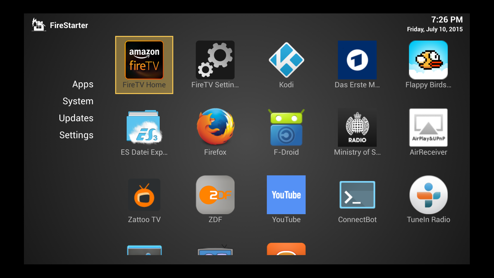
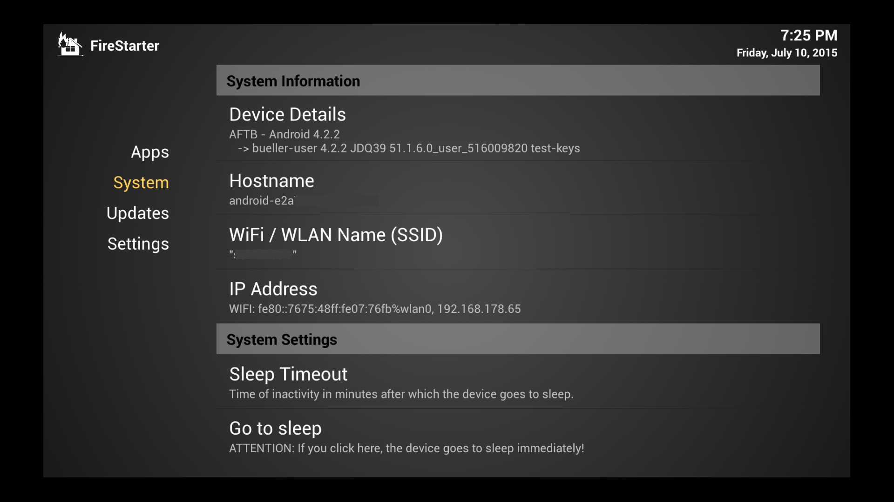
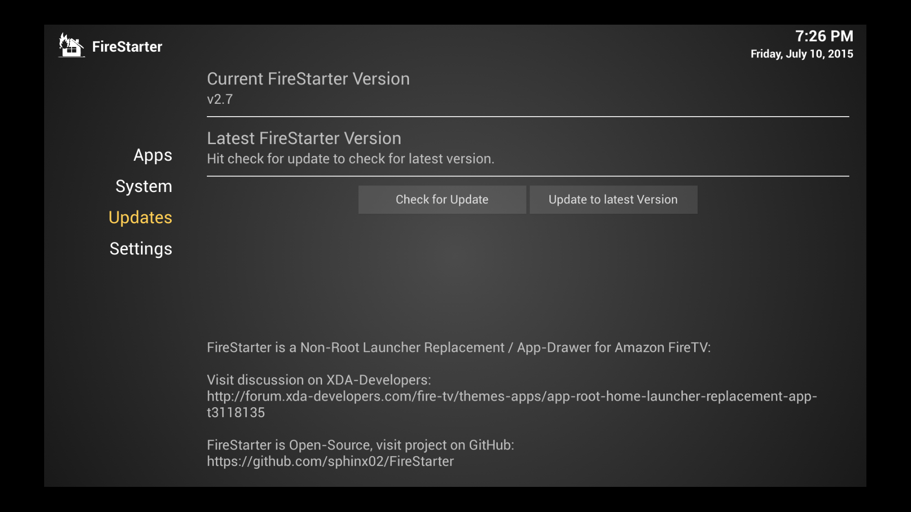
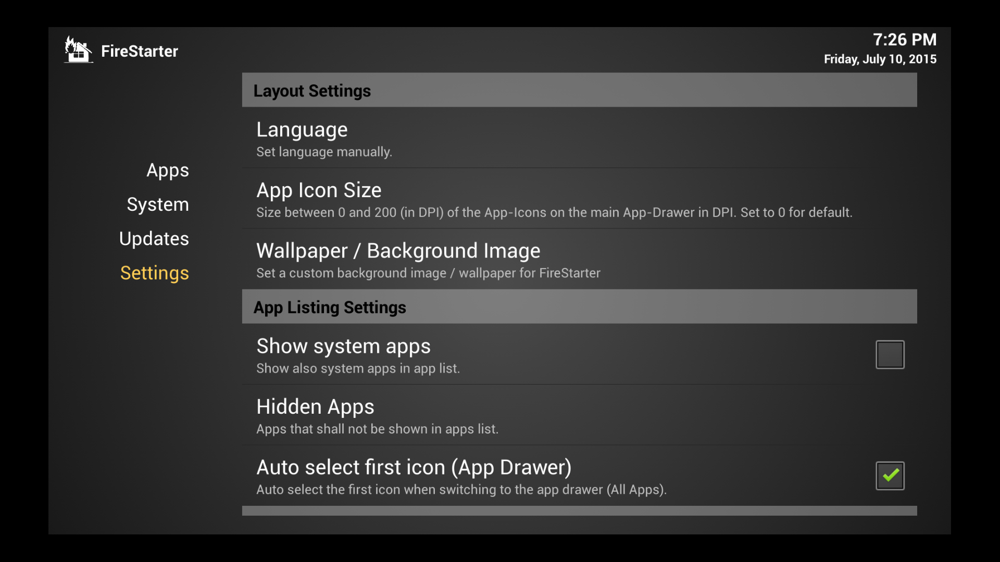
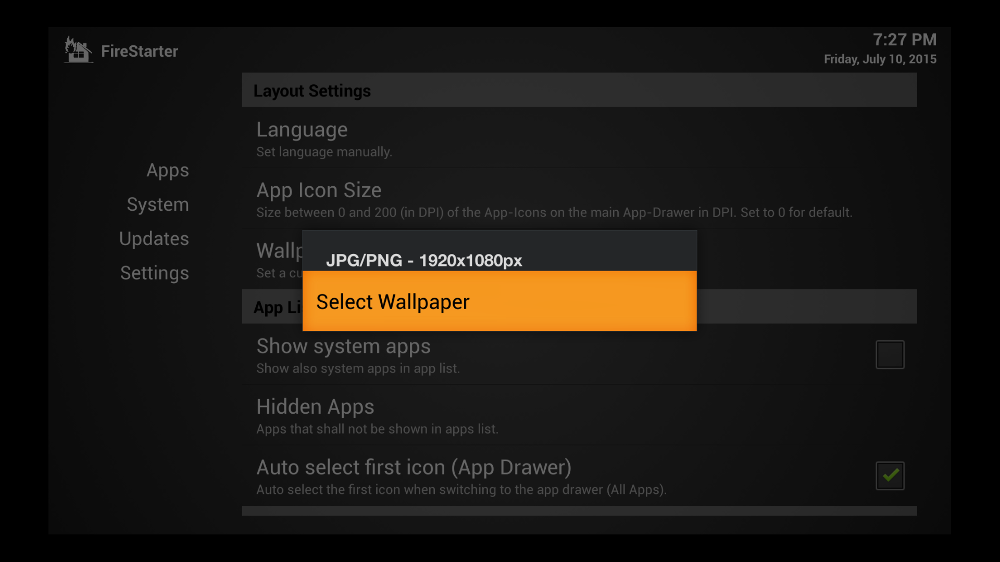

 Поджигатель
=========

__Поджигатель is a Non-Root Launcher Replacement / App-Drawer for Amazon FireTV:__

Based on FireStarter, which now only available as crippled AppStarter, "thanks" to the gracious blacklisting of the world's largest online retailer.

Podzhigatel is one possible Latinized version of the Russian word поджигатель, which is one possible translation for the American English word firestarter.

* For the not yet crippled version visit [jkchr1s/FireStarter](https://github.com/jkchr1s/FireStarter) off of which this version is based.
* For the crippled version visit  [sphinx02/AppStarter](https://github.com/sphinx02/AppStarter). **Please** do not hassle sphinx02 about *this* fork or complain to him about the stupid behavior of said online retailer. Instead be grateful and if you can afford it, buy him a drink (see at the bottom of this page for donation).

### Changes over the version from jkchr1s/FireStarter:

I decided to rename the class path after a [river in South America](https://en.wikipedia.org/wiki/Amazon_River) to avoid confusion and to avoid blacklisting.

### Features:
 
 * Similar to Redth's [FiredTVLauncher](https://github.com/Redth/FiredTVLauncher) with __REAL HOME BUTTON CLICK DETECTION__
 * (and no "amazon home is top-application"-detection).
 * __Even double-home-clicks are captured!!__
 * Completely configurable which app is started on startup-, home-button-single-click or home-button-double-click.
 * Default: Starts itself on FireTV-Startup.
 * Default: Starts itself when Home-Button is single-clicked.
 * Default: Starts amazon home when Home-Button is double-clicked (actually does nothing as amazon home is the default action for home-button clicks). 
 * You can e.g. start Kodi on double-click and Поджигатель on single-click.
 * Also possible is to keep up the default behaviour (" - No Action - ") on a single-click (amazon home is starting) and to open e.g. Поджигатель on a double-click.
 * Lists all user-installed apps including sideloaded / adb installed apps.
 * Apps can be easily sorted / ordered by settings-button or click-drag-and-drop (long-click to start drag-and-drop).
 * Apps can be hidden from app drawer (see settings).
 * Kodi and SPMC can be installed and updated directly out of Поджигатель (see Updates section).
 * Possibility to change the time of no action the FireTV waits to go to sleep.
 * Possibility to import / export settings.
 * Show system and device informations like Android-Version, Build-Version, Hostname, WiFi- / WLAN Name (SSID), IP Adress and Uptime.
 * Automatic update mechanism.
 * __No root required!__

### Install Поджигатель:

 * [Easy installation in less than 5 minutes with only the FireTV](https://github.com/sphinx02/AppStarter/wiki/Install-AppStarter-and-Kodi-%28only-FireTV-needed%29)
 * Standard installation via ADB (FIXME)
   * If you don't know how to sideload/install apps via ADB, read a tutorial (e.g. [this one](http://kodi.wiki/view/HOW-TO:Install_Kodi_on_Fire_TV))
   * [Download latest Поджигатель APK](https://github.com/dRhsjmy6/podzhigatel/releases)" and sideload/install with `adb`: 
     * E.g. `adb install -r Podzhigatel-*.apk`
   * Start Поджигатель once from the settings menu 
   * ADB-Debugging needs to stay enabled (do not disable ADB-Debugging after installation).
   * Enjoy :)
 
### Screenshots:

### Why using it and how it works:
 * Поджигатель is for all people who dont want to root (and therefore loose warranty) their FireTV's.
 * On the FireTV, Amazon allows no alternative default launchers and in the default launcher of Amazon, no sideloaded (via adb installed apps) are shown. They have to be started via the FireTV settings menu which is really inconvenient.
 * Solutions currently out there are either using root-rights to replace the home launcher or they are polling the top application in the background and then starting other apps if e.g. the Amazon default launcher is detected.
 * Поджигатель uses the fact, that every time the home-button is clicked, there is a special output in the adb logcat log. Поджигатель starts a local adb logcat session and waites for this output (which is only working as long adb is enabled in FireTV settings). This approach has the advantage, that the top activity dont has to change to detect a home-button click. Поджигатель is therefore even able to detect a double-click and starting any actions on home-button single- or double-clicks.
 * Still not solved is the problem, that the default launcher flashes shortly before the right app is started. The default-behaviour of the home-button can still not be disabled.

### Building Поджигатель:

 * Download and unpack the [Android SDK](https://developer.android.com/studio/index.html#downloads)
   * We will refer to the location to which you unpacked it as `ANDROID_HOME`; e.g. `~/android-sdk-linux` in the command lines below
 * Update Android SDK and install the appropriate build tools with `tools/android update sdk --filter build-tools-22.0.1 --no-ui` (inside the `ANDROID_HOME`)
 * Install the JRE and JDK, I for one am using 1.7 on x86-64 Ubuntu and installed it using: `apt-get install default-jre-headless default-jdk lib32stdc++6 lib32z1` (the last two packages are required to execute `aapt` from the 22.0.1 build tools on x86-64 Ubuntu)
 * Clone this project with `git clone https://github.com/dRhsjmy6/podzhigatel.git` (install `git` if necessary)
 * Build the release configuration using `env ANDROID_HOME=~/android-sdk-linux/ ./gradlew assembleRelease` (adjust the path if necessary)

### Credits:

 * [markdown-editor](https://jbt.github.io/markdown-editor/) for markdown creation
 * [FiredTVLauncher](https://github.com/Redth/FiredTVLauncher) for a lot of brilliant ideas
 * [XDA-User g4rb4g3](http://forum.xda-developers.com/showpost.php?p=56319876&postcount=87) for the home-button detection idea
 
### Donation:
Now go buy the original author a hot or cold beverage!

 * 
 * <a href="https://www.paypal.com/cgi-bin/webscr?cmd=_s-xclick&hosted_button_id=KKQ6VU34YGKYS" target="_blank">PayPal donation link</a>
